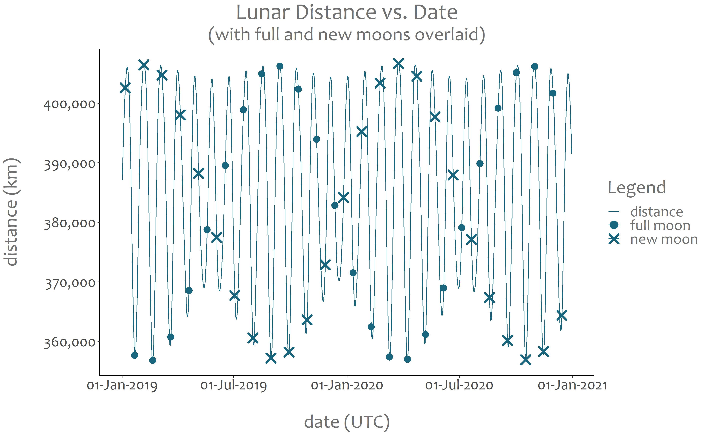

# Supermoon

Supermoon estimator; prediction of the timing and distance of a perigee full or new moon for 2001–2100.

---

<figure style="width:632px;">
  
  <figcaption>Figure 1. Lunar distance vs. date, over 2019 and 2020. Supermoons occur when a full or new moon coincides with minimum lunar distance. Adapted from Stenborg (2022), below.</figcaption>
</figure>

---

### Key Files

- SuperMoon.rmd &nbsp;&nbsp; R code, intended for use in RStudio. 
- SuperMoon.md &nbsp;&nbsp;&nbsp; GitHub-browsable code with example results, including 2001&ndash;2100 supermoon listing.

### Software Requirements

- Fortran (optional, see notes below). 
- R. 
- RStudio. 

The R program is supported by files implementing ELP-2000/82 (the Fortran program elp82b_2.f and associated data files ELP1 to ELP36, see Chapront-Touzé, M., & Chapront, J. 1983, A&A, 124, 50). It's assumed elp82b_2.f has been compiled into "elp82b_2" (either a shared object on Unix/Linux or dll on Windows), in the same directory as the R program. An elp82b_2.dll, compiled with MinGW-w64, has been included in this repository and may save some Windows users from compiling elp82b_2.f themselves.

### Reference

Stenborg, TN 2022, "[21st Century Supermoon Estimation in R](https://aspbooks.org/custom/publications/paper/532-0247.html)", in JE Ruiz, F Pierfederici and P Teuben (eds), Astronomical Data Analysis Software and Systems XXX, Astronomical Society of the Pacific, pp. 247&ndash;250.
